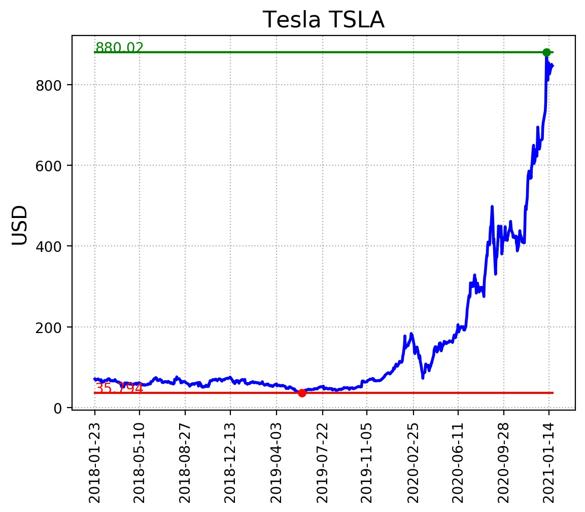

# Degiro API
API to get portfolio summary as well as full info from a stock.

## Requirements
This repo requires python 3.x. To install dependencies:
```
pip install -r requirements.txt
```

## Usage
`python degiro.py username password command...`

Alternatively, you can store your credentials in a file and run:
`python degiro.py your_credential_file commad...`

For now, only commands **portfolio** and **query** are supported.

### Get portfolio summary
Example command:

```
python degiro.py username password portfolio
```

This will return info of every stock in your portfolio together with any cash funds.

### Query a particular stock
Example command:

```
python degiro.py username password query tesla three_years
```

This will produce a price plot of Tesla in the last 3 years and an excel file with detailed 
information of this stock e.g. P/E, financials, holders, balance sheets, etc.

